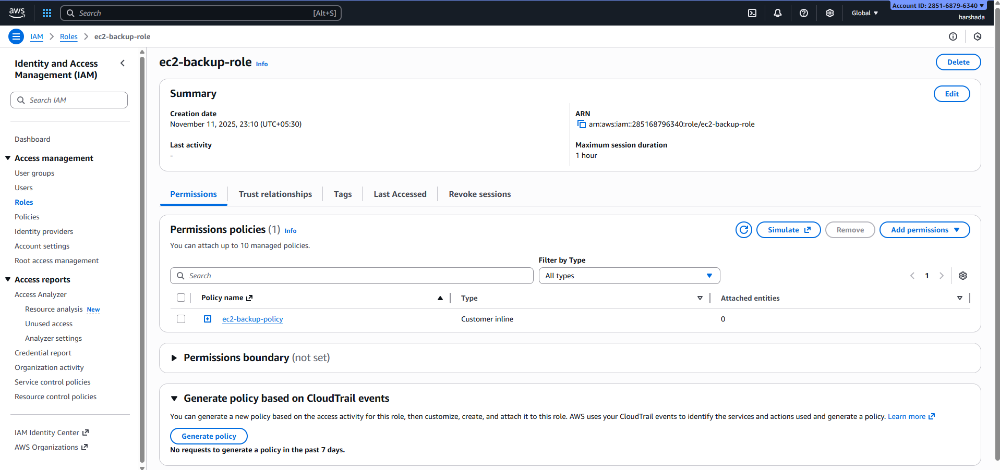
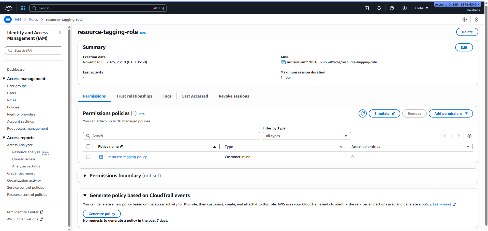
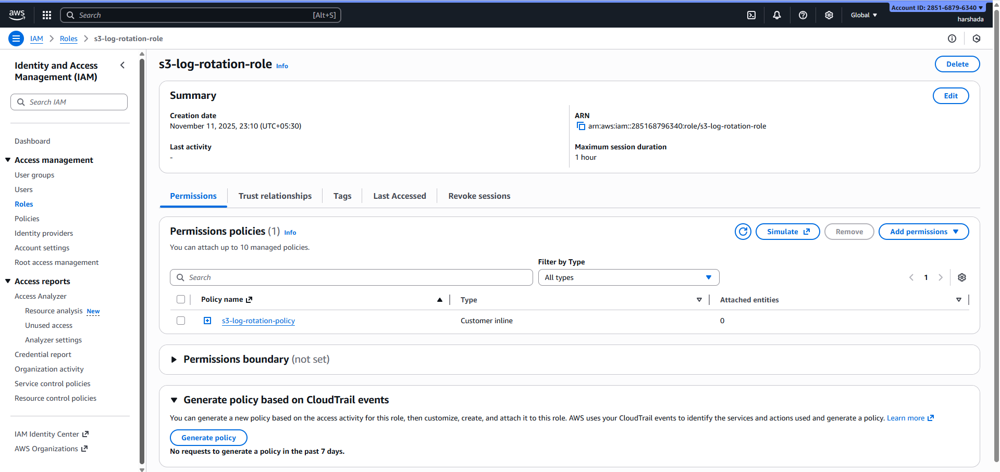

# Serverless Infrastructure Automation — README

**Project Title:** Serverless Infrastructure Automation using AWS Lambda & EventBridge

## 📘 Overview

This project demonstrates how to automate common AWS infrastructure management tasks using a **serverless architecture** built with **AWS Lambda**, **EventBridge**, and **IAM**. It automates tasks such as EC2 volume backup, snapshot cleanup, resource tagging, and S3 log rotation — all without requiring manual intervention.

---

## 📁 Project Structure

```
serverless-automation-project/
├── deploy_all.sh                     # Main script to deploy all components
├── deployment/                       # Deployment helper scripts
│   ├── create-iam-roles.sh           # Script to create IAM roles and attach policies
│   └── setup-eventbridge.sh          # Script to configure EventBridge rules
├── docs/
│   └── cost-analysis.md              # Simple cost analysis report (fresher level)
├── eventbridge-rules/                # JSON rules for scheduling Lambda functions
│   ├── ec2-backup-schedule.json
│   ├── resource-tagging-schedule.json
│   ├── s3-log-rotation-schedule.json
│   └── snapshot-cleanup-schedule.json
├── iam-policies/                     # IAM policies for Lambda functions
│   ├── ec2-backup-policy.json
│   ├── resource-tagging-policy.json
│   ├── s3-log-rotation-policy.json
│   └── snapshot-cleanup-policy.json
├── lambda-functions/                 # Lambda source code for each automation task
│   ├── ec2-backup/
│   │   ├── ec2-backup.zip
│   │   └── lambda-functions.py
│   ├── resource-tagging/
│   │   └── lambda-functions.py
│   ├── s3-log-rotation/
│   │   ├── lambda-functions.py
│   │   └── output.json
│   └── snapshot-cleanup/
│       └── lambda-functions.py
└── screenshots/                      # Screenshots for documentation and presentation
```

---

## ⚙️ Workflow Description

1. **EventBridge Rules** — Schedule automated triggers for each Lambda function (daily/weekly as needed).
2. **Lambda Functions** — Perform automation tasks such as:

   * **ec2-backup:** Takes EBS volume snapshots.
   * **snapshot-cleanup:** Deletes outdated snapshots to save cost.
   * **resource-tagging:** Adds consistent tags to resources for tracking.
   * **s3-log-rotation:** Rotates and manages S3 logs.
3. **IAM Policies** — Provide least-privilege access for each Lambda function.
4. **CloudWatch** — Monitors logs and metrics for automation validation.

---

## 📸 AWS Console Screenshots

Below are actual screenshots saved under `screenshots/` directory. Each image is linked using markdown syntax so they render properly on GitHub.

### **AWS CLI and Configuration**

```markdown

```


### **CloudWatch Dashboard**

```markdown


```


### **EventBridge Dashboard and Rules**

```markdown


```


### **Lambda Dashboard and Functions**

```markdown


```


### **IAM Roles and Policies**

```markdown





```


### **Automation Results**

```markdown


```


---

## 💰 Cost Analysis (Basic - Fresher Level)

See `docs/cost-analysis.md` for detailed numbers. Summary:

* **Lambda** — Pay per execution and duration (usually under $1/month for light workloads)
* **S3** — Stores logs and code (~few cents/month)
* **Snapshots** — Cost based on data size (~$0.05/GB-month)
* **Optimization:** Automated cleanup reduces storage costs by 20–30%

---

## 🚀 How to Run

1. Configure AWS credentials:

   ```bash
   aws configure
   ```
2. Deploy IAM roles and Lambda functions:

   ```bash
   bash deployment/create-iam-roles.sh
   bash deploy_all.sh
   ```
3. Verify Lambda triggers in **EventBridge** and monitor execution in **CloudWatch Logs**.

---

## 🧾 Outcome & Benefits

* **Reduced manual operations** through serverless automation.
* **Improved compliance** with consistent tagging.
* **Lower storage costs** due to automatic snapshot cleanup.
* **Centralized monitoring** using CloudWatch dashboards.

---

## 👩‍💻 Author

**Harshada Haryan**
*Fresher Cloud Support Engineer Project — AWS Lambda & EventBridge Automation*
